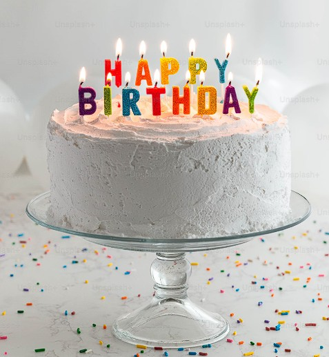
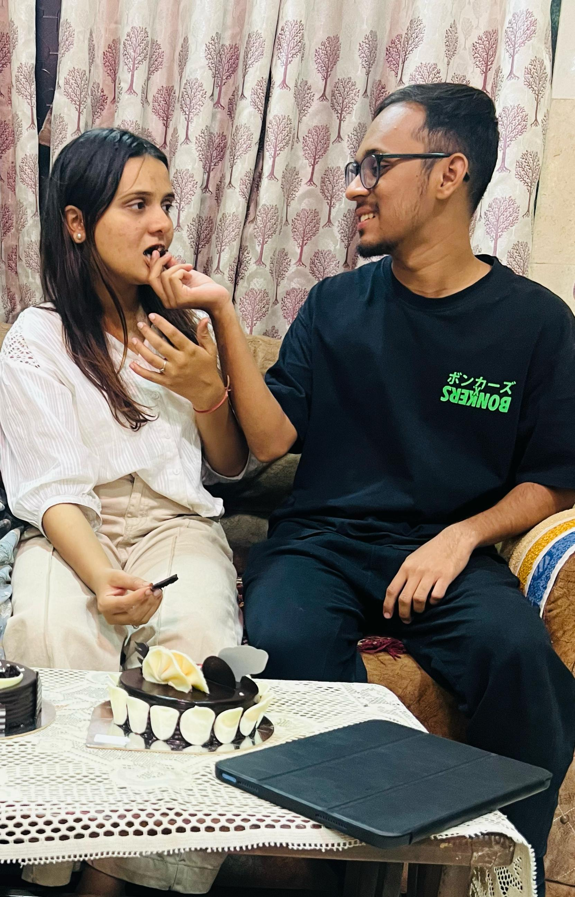
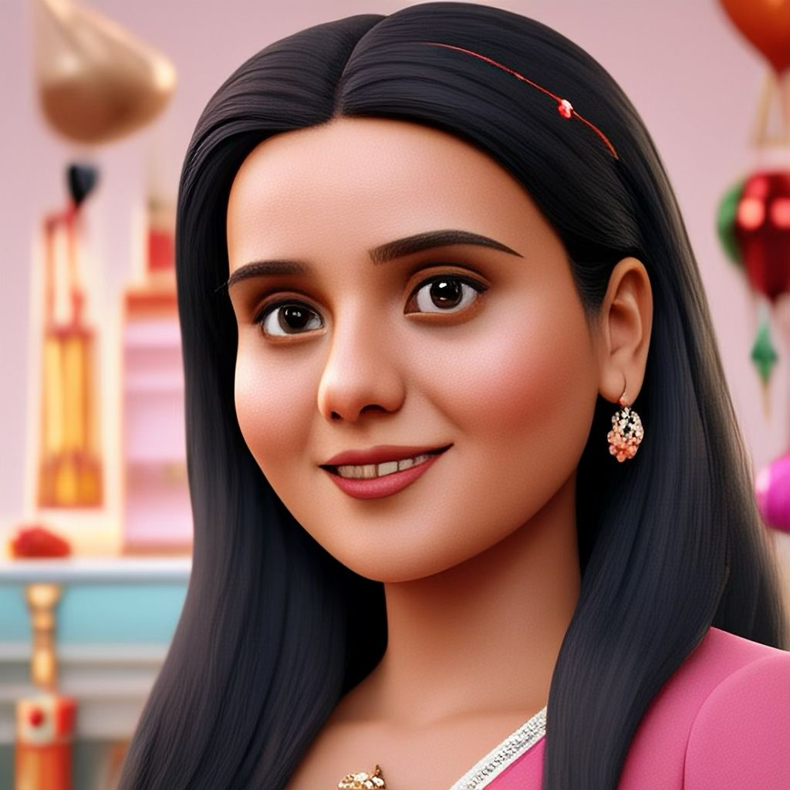

<html lang="en">
<head>
    <meta charset="UTF-8">
    <meta name="viewport" content="width=device-width, initial-scale=1.0">
    <title>Happy Birthday Akanksha!</title>
    
</head>
<body>
       

    

        <h1>HAPPY BIRTHDAY AKANKSHA!🎉🎂💖</h1>
        

            Wishing you a day filled with joy, laughter, and everything you love and a year ahead that's even better than the last.
        

        

        

            
            

                

            

        

        

            

                
            

            

                
            

            

                
                

            

            

                
            

        

        

        

            Dear Akanksha, On this special day, I just want to remind you how incredibly amazing you are. 
            You bring so much joy, love, and light into my life, and I’m beyond grateful for you every single day.
            May this year bring you endless happiness, success, and all the beautiful moments you deserve.
            Here’s to more laughter, adventures, and unforgettable memories together! 🥂✨
        

        <button class="btn" id="playBtn">Play Birthday Song</button>
        <button class="btn" id="moreBtn">More Confetti!</button>
        <button class="btn" id="wishBtn">Make a Wish</button>

        

            <textarea class="birthday-wish" id="wishText" placeholder="Write your birthday wish for Akanksha here..."></textarea>
            <button class="btn" id="submitWish">Submit Wish</button>

            

        

    

    

        

            <button class="close-memory" onclick="closeMemory()">×</button>
            <h3 class="memory-title" id="memoryTitle">Memory Title</h3>
            
Memory description goes here.

            
        

    

    
    <audio id="birthdaySong" src="birthday-song.mp3.mp3"></audio>
    <audio id="blowSound" src="https://assets.mixkit.co/active_storage/sfx/212/212-preview.mp3"></audio>

    
</body>
</html>
